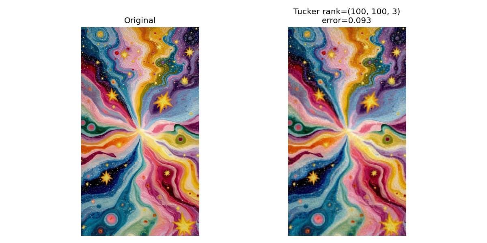
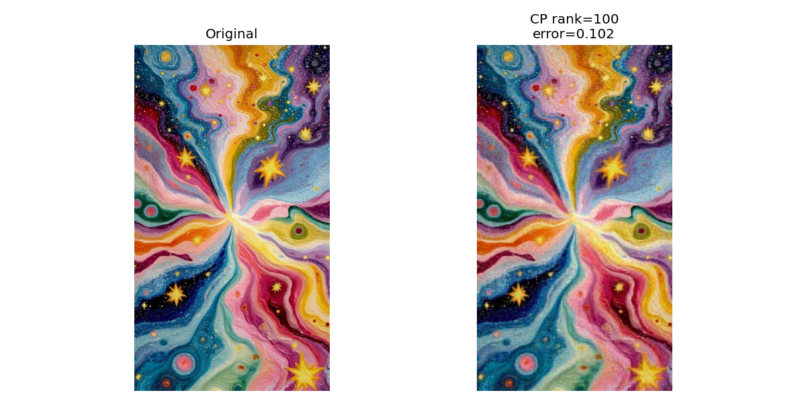
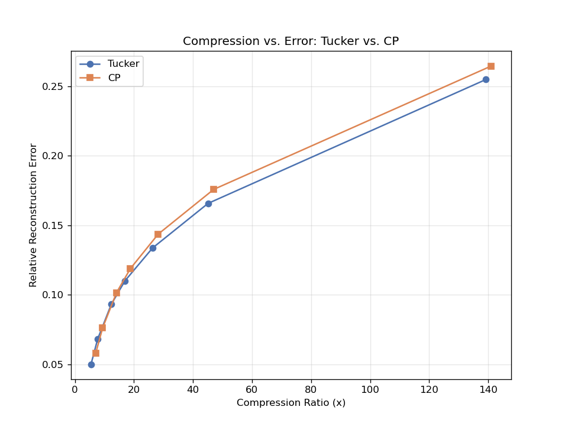

# tensor-decomposition

# Tensor Decomposition: Tucker vs. CP

A hands-on comparison of two classical tensor decomposition methods — **Tucker**
(via HOSVD) and **CP/PARAFAC** (via ALS) — applied to a real RGB image, treated
as a 3rd-order tensor of shape `(Height, Width, 3)`.

## Why this project

Both methods approximate a tensor using fewer parameters than the original,
but they make different structural assumptions:

- **Tucker** allows a full, dense **core tensor** connecting orthogonal factor
  matrices — one independent rank per mode `(r1, r2, r3)`.
- **CP** forces the core to be diagonal — the tensor is written as a sum of
  `R` rank-1 outer products, with a single rank `R`.

This project measures, empirically, how that structural difference plays out
in compression ratio and reconstruction quality on real image data.

## Repo structure
tensor-decomposition/
├── data/
│   └── my_image.jpg
├── tucker/
│   └── tucker_demo.py
├── cp/
│   └── cp_demo.py
├── rank_sweep.py
├── results/
│   ├── tucker_result.png
│   ├── cp_result.png
│   └── rank_sweep_comparison.png
└── README.md

## Setup

```bash
python3 -m venv venv
source venv/bin/activate
pip install numpy tensorly matplotlib pillow
```

## Usage

```bash
cd tucker && python tucker_demo.py     # single Tucker decomposition
cd ../cp && python cp_demo.py          # single CP decomposition
cd .. && python rank_sweep.py          # compare both across ranks
```

## Results

### Single-rank comparison

| Method | Rank | Relative Error | Compression Ratio |
|---|---|---|---|
| Tucker | (100, 100, 3) | 0.0931 | 12.32x |
| CP | 100 | 0.1016 | 14.10x |

Tucker achieves lower reconstruction error at these settings; CP achieves
higher compression. This reflects Tucker's extra flexibility from its dense
core tensor, at the cost of needing more stored parameters.




### Rank sweep: compression vs. error tradeoff



This is the rate-distortion curve for both methods across ranks
`[10, 30, 50, 75, 100, 150, 200]`. Whichever curve sits lower, at a given
compression ratio, is the better method *at that operating point* — see
`NOTES.md` for a detailed reading of this plot.

## Key concepts demonstrated

- Representing an image as a 3rd-order tensor
- Tensor fibers and mode-n unfoldings
- HOSVD for Tucker decomposition
- ALS for CP decomposition
- Multilinear rank vs. single rank
- Relative Frobenius reconstruction error
- Compression ratio as a function of stored parameters
